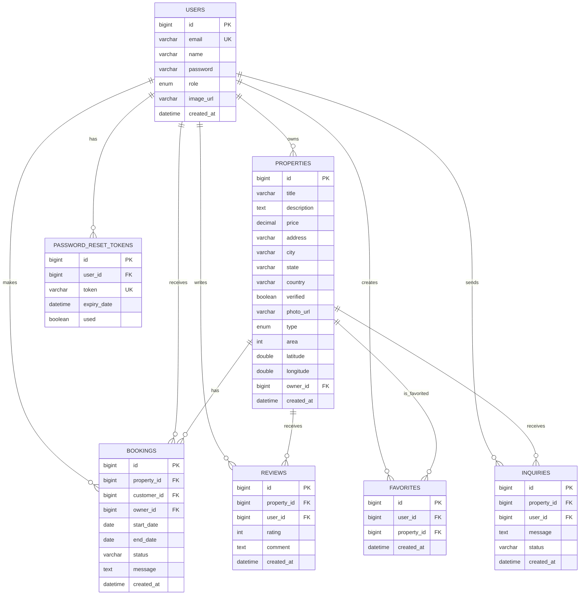

# Commercial Space Booking System - Database ERD

## Database Schema Details:

### Key Features:
1. **User Management**: Multi-role system (Admin, Owner, Customer)
2. **Property Management**: Comprehensive property details with verification system
3. **Booking System**: Complete booking lifecycle with status tracking
4. **Review System**: Rating and comment system for properties
5. **Favorites**: User bookmarking system
6. **Password Reset**: Secure token-based password recovery
7. **Inquiries**: Direct communication between users and property owners

### Security Features:
- **Password Hashing**: BCrypt encryption for user passwords
- **JWT Authentication**: Token-based session management
- **Role-based Access**: Granular permissions based on user roles
- **Input Validation**: Server-side validation for all inputs
- **CORS Configuration**: Secure cross-origin requests

### Data Integrity:
- **Foreign Key Constraints**: Maintain referential integrity
- **Unique Constraints**: Prevent duplicate data
- **Check Constraints**: Ensure data validity (e.g., rating 1-5)
- **Cascade Operations**: Proper cleanup on deletions

### Performance Optimizations:
- **Indexed Fields**: Fast queries on frequently searched fields
- **Lazy Loading**: Efficient loading of related entities
- **Pagination**: Handle large datasets efficiently
- **Caching**: Reduce database load for frequently accessed data
