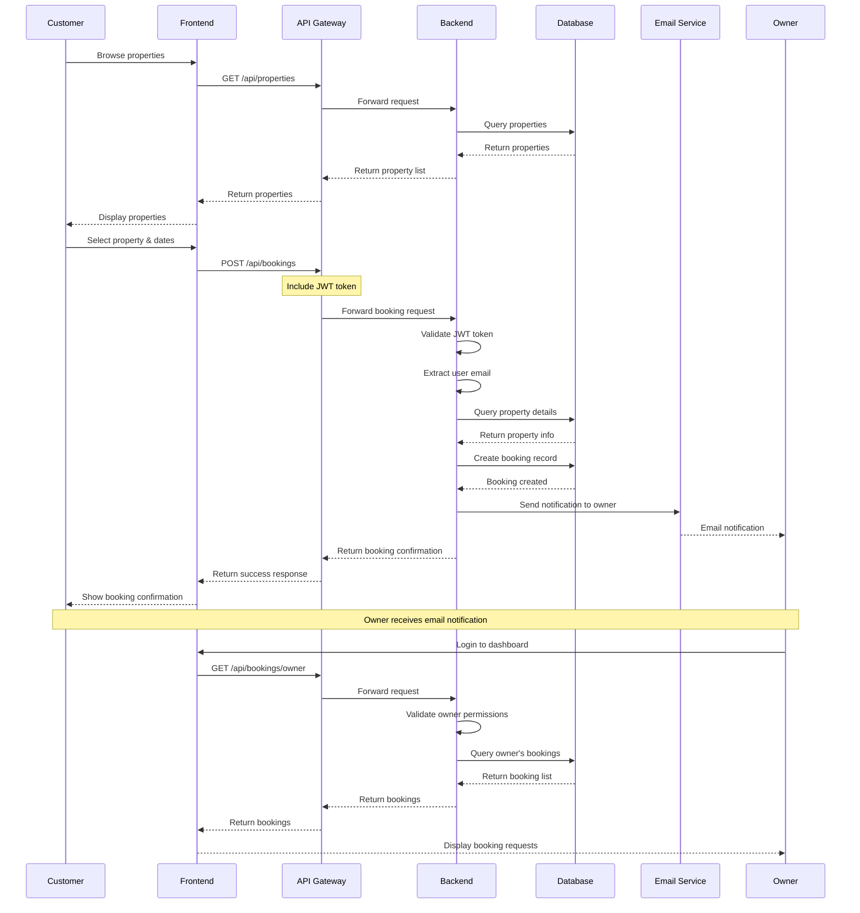
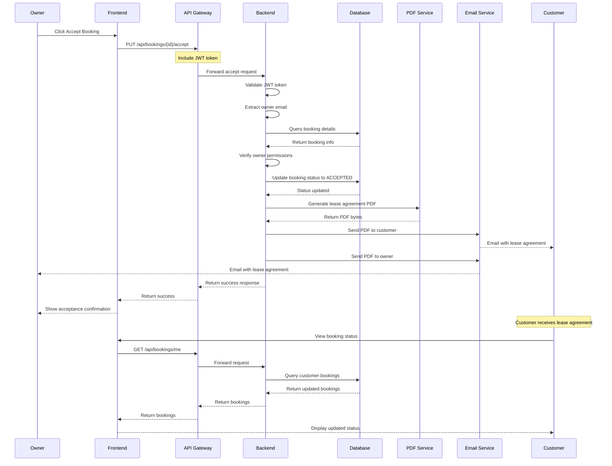
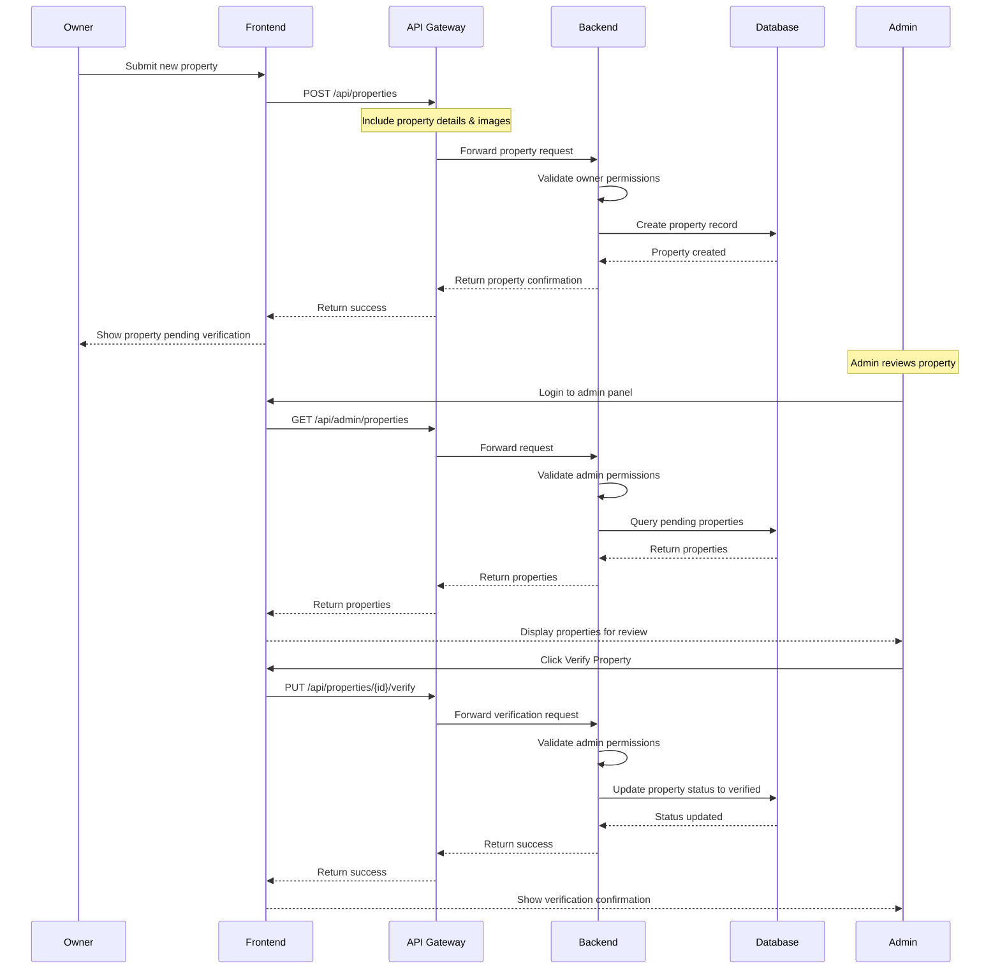
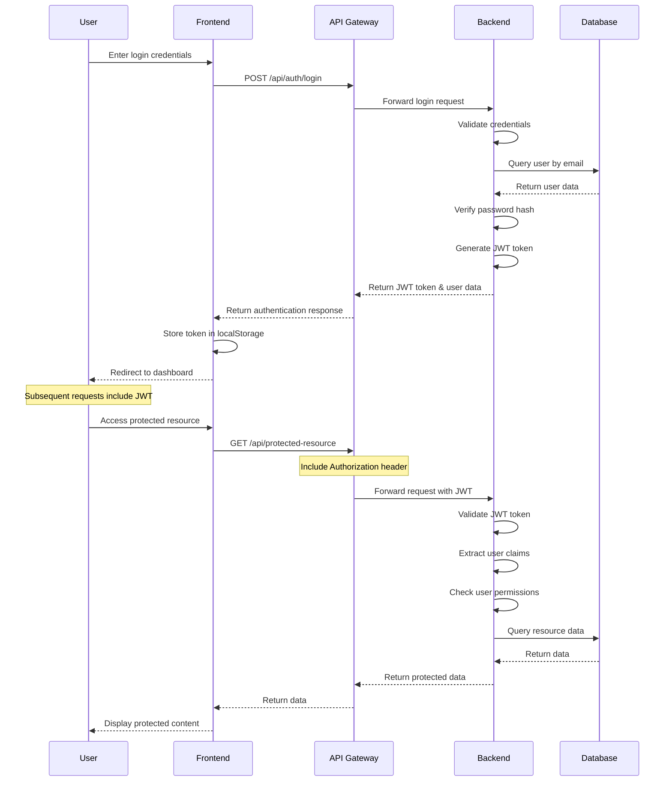

# Commercial Space Booking System - Sequence Diagram

## Booking Creation Sequence

```mermaid
sequenceDiagram
    participant C as Customer
    participant F as Frontend
    participant A as API Gateway
    participant B as Backend
    participant DB as Database
    participant E as Email Service
    participant O as Owner

    C->>F: Browse properties
    F->>A: GET /api/properties
    A->>B: Forward request
    B->>DB: Query properties
    DB-->>B: Return properties
    B-->>A: Return property list
    A-->>F: Return properties
    F-->>C: Display properties

    C->>F: Select property & dates
    F->>A: POST /api/bookings
    Note over A: Include JWT token
    A->>B: Forward booking request
    B->>B: Validate JWT token
    B->>B: Extract user email
    B->>DB: Query property details
    DB-->>B: Return property info
    B->>DB: Create booking record
    DB-->>B: Booking created
    B->>E: Send notification to owner
    E-->>O: Email notification
    B-->>A: Return booking confirmation
    A-->>F: Return success response
    F-->>C: Show booking confirmation

    Note over C,O: Owner receives email notification
    O->>F: Login to dashboard
    F->>A: GET /api/bookings/owner
    A->>B: Forward request
    B->>B: Validate owner permissions
    B->>DB: Query owner's bookings
    DB-->>B: Return booking list
    B-->>A: Return bookings
    A-->>F: Return bookings
    F-->>O: Display booking requests
```

## Booking Acceptance Sequence

```mermaid
sequenceDiagram
    participant O as Owner
    participant F as Frontend
    participant A as API Gateway
    participant B as Backend
    participant DB as Database
    participant P as PDF Service
    participant E as Email Service
    participant C as Customer

    O->>F: Click Accept Booking
    F->>A: PUT /api/bookings/{id}/accept
    Note over A: Include JWT token
    A->>B: Forward accept request
    B->>B: Validate JWT token
    B->>B: Extract owner email
    B->>DB: Query booking details
    DB-->>B: Return booking info
    B->>B: Verify owner permissions
    B->>DB: Update booking status to ACCEPTED
    DB-->>B: Status updated
    B->>P: Generate lease agreement PDF
    P-->>B: Return PDF bytes
    B->>E: Send PDF to customer
    E-->>C: Email with lease agreement
    B->>E: Send PDF to owner
    E-->>O: Email with lease agreement
    B-->>A: Return success response
    A-->>F: Return success
    F-->>O: Show acceptance confirmation

    Note over C: Customer receives lease agreement
    C->>F: View booking status
    F->>A: GET /api/bookings/me
    A->>B: Forward request
    B->>DB: Query customer bookings
    DB-->>B: Return updated bookings
    B-->>A: Return bookings
    A-->>F: Return bookings
    F-->>C: Display updated status
```

## Property Verification Sequence

```mermaid
sequenceDiagram
    participant O as Owner
    participant F as Frontend
    participant A as API Gateway
    participant B as Backend
    participant DB as Database
    participant AD as Admin

    O->>F: Submit new property
    F->>A: POST /api/properties
    Note over A: Include property details & images
    A->>B: Forward property request
    B->>B: Validate owner permissions
    B->>DB: Create property record
    DB-->>B: Property created
    B-->>A: Return property confirmation
    A-->>F: Return success
    F-->>O: Show property pending verification

    Note over AD: Admin reviews property
    AD->>F: Login to admin panel
    F->>A: GET /api/admin/properties
    A->>B: Forward request
    B->>B: Validate admin permissions
    B->>DB: Query pending properties
    DB-->>B: Return properties
    B-->>A: Return properties
    A-->>F: Return properties
    F-->>AD: Display properties for review

    AD->>F: Click Verify Property
    F->>A: PUT /api/properties/{id}/verify
    A->>B: Forward verification request
    B->>B: Validate admin permissions
    B->>DB: Update property status to verified
    DB-->>B: Status updated
    B-->>A: Return success
    A-->>F: Return success
    F-->>AD: Show verification confirmation
```

## Authentication Sequence

```mermaid
sequenceDiagram
    participant U as User
    participant F as Frontend
    participant A as API Gateway
    participant B as Backend
    participant DB as Database

    U->>F: Enter login credentials
    F->>A: POST /api/auth/login
    A->>B: Forward login request
    B->>B: Validate credentials
    B->>DB: Query user by email
    DB-->>B: Return user data
    B->>B: Verify password hash
    B->>B: Generate JWT token
    B-->>A: Return JWT token & user data
    A-->>F: Return authentication response
    F->>F: Store token in localStorage
    F-->>U: Redirect to dashboard

    Note over U: Subsequent requests include JWT
    U->>F: Access protected resource
    F->>A: GET /api/protected-resource
    Note over A: Include Authorization header
    A->>B: Forward request with JWT
    B->>B: Validate JWT token
    B->>B: Extract user claims
    B->>B: Check user permissions
    B->>DB: Query resource data
    DB-->>B: Return data
    B-->>A: Return protected data
    A-->>F: Return data
    F-->>U: Display protected content
```
