# Commercial Space Booking System - Use Case Diagram

```mermaid
graph TB
    subgraph "Actors"
        CUSTOMER[Customer]
        OWNER[Property Owner]
        ADMIN[System Admin]
        EMAIL[Email Service]
        PDF[PDF Generator]
    end

    subgraph "Authentication & User Management"
        UC1[Register Account]
        UC2[Login]
        UC3[Logout]
        UC4[Reset Password]
        UC5[Update Profile]
        UC6[View Profile]
    end

    subgraph "Property Management"
        UC7[Browse Properties]
        UC8[Search Properties]
        UC9[Filter Properties]
        UC10[View Property Details]
        UC11[Add Property]
        UC12[Edit Property]
        UC13[Delete Property]
        UC14[Upload Property Images]
        UC15[Verify Property]
        UC16[Approve Property]
        UC17[Reject Property]
    end

    subgraph "Booking Management"
        UC18[Create Booking]
        UC19[View My Bookings]
        UC20[View Owner Bookings]
        UC21[Accept Booking]
        UC22[Reject Booking]
        UC23[Cancel Booking]
        UC24[Update Booking Status]
        UC25[Generate Lease Agreement]
    end

    subgraph "Review & Rating"
        UC26[Add Review]
        UC27[View Reviews]
        UC28[Rate Property]
        UC29[Update Review]
        UC30[Delete Review]
    end

    subgraph "Communication"
        UC31[Send Email Notifications]
        UC32[Send Booking Confirmation]
        UC33[Send Lease Agreement]
        UC34[Send Rejection Notice]
    end

    subgraph "Admin Functions"
        UC35[View All Properties]
        UC36[View All Bookings]
        UC37[View All Users]
        UC38[Generate Reports]
        UC39[Monitor System Activity]
        UC40[Manage User Accounts]
    end

    %% Customer Use Cases
    CUSTOMER --> UC1
    CUSTOMER --> UC2
    CUSTOMER --> UC3
    CUSTOMER --> UC4
    CUSTOMER --> UC5
    CUSTOMER --> UC6
    CUSTOMER --> UC7
    CUSTOMER --> UC8
    CUSTOMER --> UC9
    CUSTOMER --> UC10
    CUSTOMER --> UC18
    CUSTOMER --> UC19
    CUSTOMER --> UC26
    CUSTOMER --> UC27
    CUSTOMER --> UC28

    %% Owner Use Cases
    OWNER --> UC1
    OWNER --> UC2
    OWNER --> UC3
    OWNER --> UC4
    OWNER --> UC5
    OWNER --> UC6
    OWNER --> UC11
    OWNER --> UC12
    OWNER --> UC13
    OWNER --> UC14
    OWNER --> UC20
    OWNER --> UC21
    OWNER --> UC22
    OWNER --> UC23
    OWNER --> UC27

    %% Admin Use Cases
    ADMIN --> UC2
    ADMIN --> UC3
    ADMIN --> UC15
    ADMIN --> UC16
    ADMIN --> UC17
    ADMIN --> UC24
    ADMIN --> UC35
    ADMIN --> UC36
    ADMIN --> UC37
    ADMIN --> UC38
    ADMIN --> UC39
    ADMIN --> UC40

    %% System Use Cases
    EMAIL --> UC31
    EMAIL --> UC32
    EMAIL --> UC33
    EMAIL --> UC34
    
    PDF --> UC25

    %% Include relationships
    UC18 -.->|include| UC31
    UC21 -.->|include| UC25
    UC21 -.->|include| UC33
    UC22 -.->|include| UC34
    UC11 -.->|include| UC14
    UC26 -.->|include| UC28

    %% Extend relationships
    UC7 -.->|extend| UC8
    UC7 -.->|extend| UC9
    UC10 -.->|extend| UC27
    UC18 -.->|extend| UC32

    style CUSTOMER fill:#e3f2fd
    style OWNER fill:#f3e5f5
    style ADMIN fill:#ffcdd2
    style EMAIL fill:#fff3e0
    style PDF fill:#c8e6c9
```

## Use Case Descriptions:

### Customer Use Cases:
- **UC1-UC6**: Account management (register, login, profile)
- **UC7-UC10**: Property browsing and search
- **UC18-UC19**: Booking management
- **UC26-UC28**: Review and rating system

### Owner Use Cases:
- **UC11-UC14**: Property management (add, edit, upload images)
- **UC20-UC23**: Booking management (view, accept, reject)
- **UC27**: View property reviews

### Admin Use Cases:
- **UC15-UC17**: Property verification system
- **UC35-UC40**: System administration and monitoring
- **UC24**: Booking status management

### System Use Cases:
- **UC31-UC34**: Email notification system
- **UC25**: PDF generation for lease agreements

## Key Relationships:

### Include Relationships:
- Booking creation includes email notification
- Booking acceptance includes PDF generation and email
- Property creation includes image upload
- Review creation includes rating

### Extend Relationships:
- Property browsing extends to search and filter
- Property viewing extends to review display
- Booking creation extends to confirmation email

This use case diagram shows all the major functionalities of your commercial space booking system and how different actors interact with the system.
