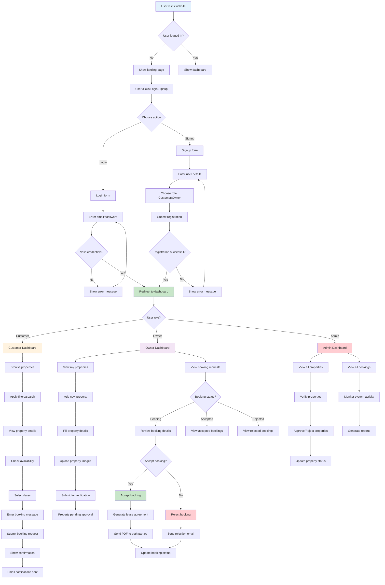

# Commercial Space Booking System - User Flow Diagram

## Key User Flows:

### Customer Flow:
1. **Registration/Login** → Browse Properties → View Details → Book Property
2. **Booking Process**: Select Dates → Add Message → Submit Request → Receive Confirmation
3. **Booking Management**: View My Bookings → Track Status → Receive Updates

### Owner Flow:
1. **Property Management**: Add Properties → Upload Images → Submit for Verification
2. **Booking Management**: Review Requests → Accept/Reject → Generate Agreements
3. **Communication**: Receive Notifications → Send Updates → Handle Inquiries

### Admin Flow:
1. **Property Verification**: Review Submissions → Approve/Reject → Update Status
2. **System Monitoring**: View All Activities → Generate Reports → Manage Users
3. **Content Management**: Monitor Properties → Track Bookings → System Analytics
